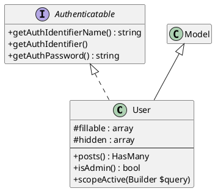

# laravel-archi

A Laravel package that analyzes your PHP classes and generates a **PlantUML class diagram** (`.puml`).

## Installation

```bash
composer require quatrebarbes/larchiclass --dev
```

Laravel auto-discovers the service provider. No manual registration needed.

---

## Usage

### Basic analyze `App\Models` (default)

```bash
php artisan larchi:model
```

Generates `larchi-model.puml` at the root of your project.

### Custom namespace

```bash
php artisan larchi:model --namespace="App\Services"
```

### Custom output file

```bash
php artisan larchi:model --output="docs/diagram.puml"
```

### Both options combined

```bash
php artisan larchi:model --namespace="App\Domain\Billing" --output="docs/billing.puml"
```

---

## What the diagram shows

| Element | Included |
|---|---|
| Properties | ✅ with type and visibility (`+`, `#`, `-`) |
| Methods | ✅ with parameters, return type and visibility |
| Inheritance (`extends`) | ✅ |
| Interface implementation (`implements`) | ✅ (for interfaces in the same namespace) |
| Trait usage | ✅ (for traits in the same namespace) |
| Abstract classes | ✅ (`abstract class` keyword) |
| Interfaces | ✅ (`interface` keyword) |
| Traits | ✅ (annotated with `<<trait>>`) |

---

## Viewing the diagram

- **VS Code** - install the [PlantUML extension](https://marketplace.visualstudio.com/items?itemName=jebbs.plantuml) and press `Alt+D`
- **IntelliJ / PhpStorm** - built-in PlantUML support
- **Online** - paste the content at https://www.plantuml.com/plantuml/uml
- **CLI** - `java -jar plantuml.jar larchi-model.puml`

---

## Example output



---
